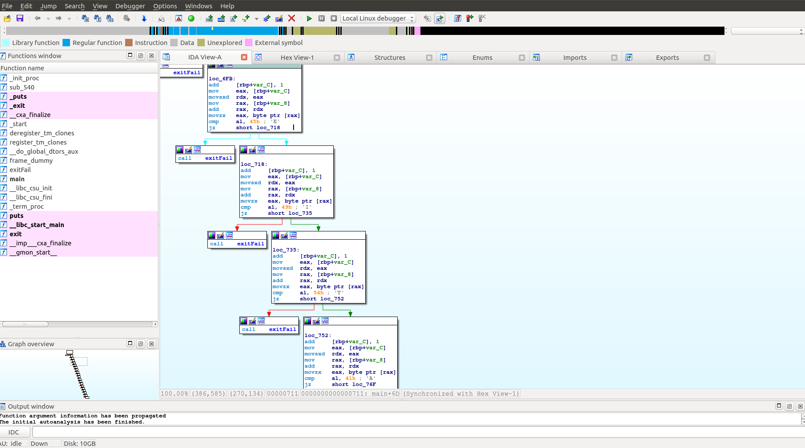

## Dry execution

We execute the executable without parameters and we get:

`Usage: runme <Flag>`

We obviously need to supply a key.

## Analyzing

We open the executable in our favorite disassembler(In this case IDA) and we see this structure.

We can see a simple if-else structure that check each byte from the input string individually and compares it to the flag.

We follow this structure and we conclude that the flag is:

**MEITAR{R3_13_FuN}**