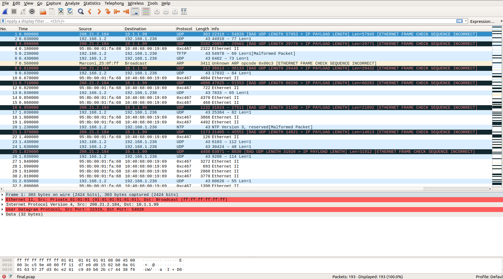
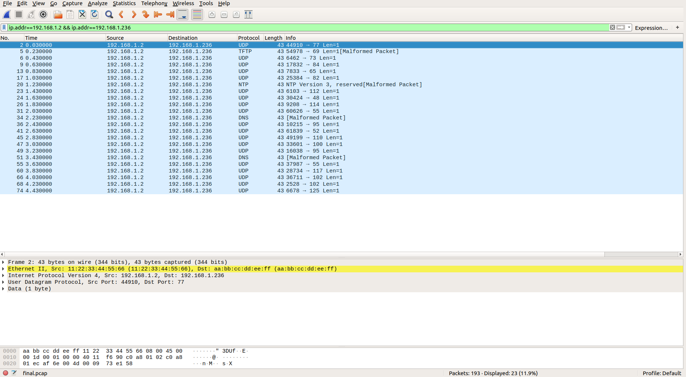
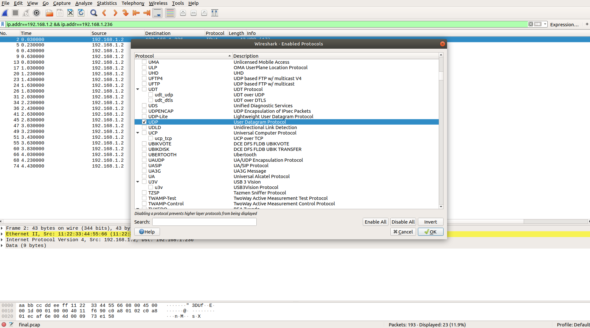
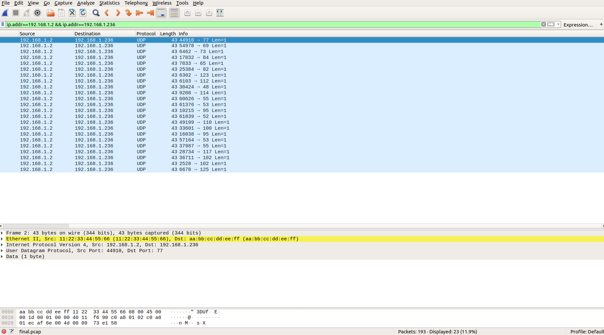

# La Porta Di Casa

This challenge is a networking challenge.

Our first hint is the name of the challenge (porta ~= port)

## First look

Opening the pcap in Wireshark tells us we have a tiny pcap. We also see some UDP traffic and a weird ass protocol Wireshark names "0xc467". We can ignore those kind of traffic well as the malformed UDP packets

## Narrowing down the search for anomalies

This pcap file is quite messy, it's almost impossible to analyze the whole file, when we are looking for anomalies in traffic we might want to isolate a specific conversation of endpoints, luckily for us, Wireshark has a special tool for this purpose.

 We go to **Statistics** > **Conversations** > **IPv4**. And we can see 2 conversations:

10.1.1.99		-->	208.21.2.184

192.168.1.2	-->	192.168.1.236

Let's try to isolate the traffic between 192.168.1.2 --> 192.168.1.236.

Right click on this tab and select: **Apply as filter** > **Selected** > **A <--> B**

And now we should see this traffic.

## Analyzing the traffic

We can see that most of this data is encapsulated by UDP, we can also see that most of the packets has a data length of 1 byte. If we examine the packets we can see that all of them has a payload which is simply the letter X.

We can also see that most of the packets has some weird destination ports. There are also packets that are not recognized by UDP or appeared to be malformed, that's because Wireshark assumes  those packets are using a certain protocol because of theirs destination port number(which we concluded that it's seems suspicious). So let's tell Wireshark  to ignore all the protocols except from UDP and IPV4.

Go to **Analyze** > **Enabled protocols**. And disable everything, then enable IPV4, UDP and Ethernet individually like so.

Now we have list of packets that's using UDP, all have the same data 'X', and the only thing that's differ is the **destination port**.

We assume that each port number is the ASCII value of the flag and we get:

**MEITAR{p0r75_4nd_57uff}**

ps. Don't forget to re-enable the protocols we've disabled. 