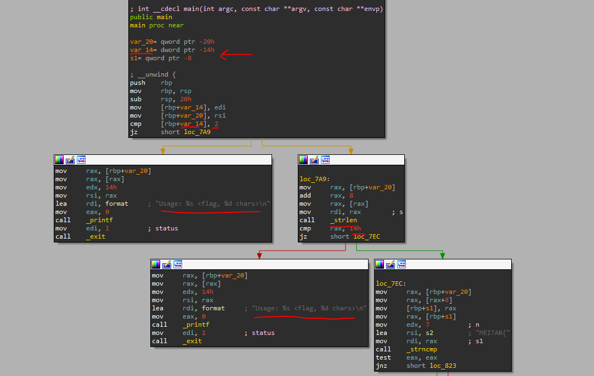
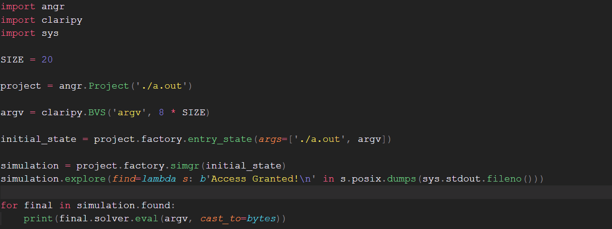

# Keygen2

This is a simple keygen, that does some binary operations on the flag.
Let's try to open the challenge in ida

Nice! Our binary is non-stripped, meaning we have some residue from the programmer.
We see two checks for "Usage", one is referencing a stack variable, a function parameter, argc.
This is the check if argc is equal to 2.

if (argc == 2)

Meaning, this program expects 2 arguments (the first arg is the filename while the second is our flag).

The second check calls strlen on the second member of argv (see the add 8? we are jumping 8 bytes forward in memory, the size of x64 address).
We are checking to see if the flag is 0x14 (20) chars long.

Then we have some binary operations on each of the chars of the flag.
First checking the first 7 bytes for "MEITAR{" and the last one for "}".

Reversing the binary operations is pretty straight forward, I'll just point out that gcc done some optimizations and saved you guys 6 chars for reversing!

**MEITAR{b1n4ry_1s_ez}**

# Bonus Solution (angr)

DM me for explanation!